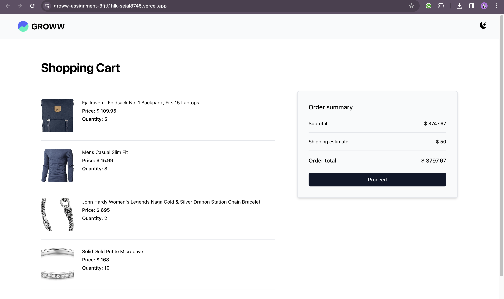
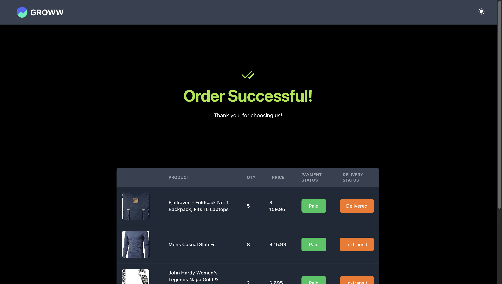
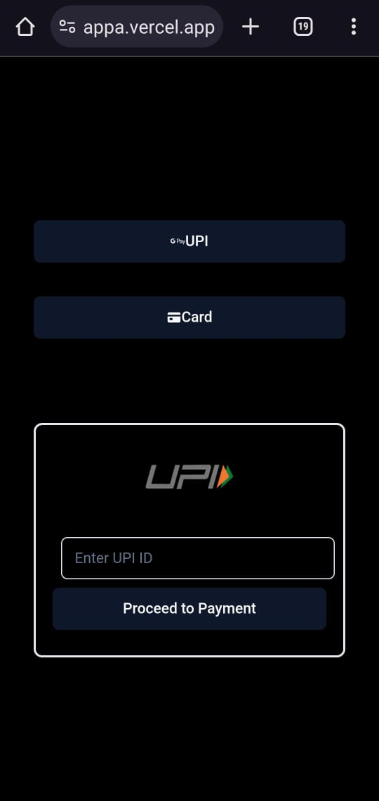

# Chaeckout Experience
Welcome to the Checkout Experience project brought to you by GROWW! This assignment focuses on crafting an intuitive and visually captivating checkout process, specifically honing in on the final three stages: the Checkout Page, Payment Options Page, and Order Confirmation Page.

## Project Overview
### ***Checkout Page***
- Dynamic Cart UI: Fetches data from an [API](https://groww-intern-assignment.vercel.app/v1/api/order-details) to dynamically construct a shopping cart.
- Order Summary Section: Provides a comprehensive overview of all cart items, including subTotal price of all the ordeers, shipping fees. Featuring a prominent "Proceed to Pay" button.
- Transaction ID: Generates a random transaction ID and stores it using the Zustand state manager upon clicking the "Proceed to Pay" button.

### ***Payment Options Page***
- Payment Modes: Presents users with various payment options to choose from using the Payemnt Methods available in the api.
- Validation: The user is now prompted to select a payment option (e.g., UPI, card) before confirming the payment. An error notification using `react-hot-toast` is displayed if no option is selected.
  
### ***Order Confirmation Page*** 
- Random Order Delivery Status: Generates a random order delivery status, encompassing delivered, in-transit, and shipped scenarios.
- Order Summary: Provides details on the order, the selected payment method, and a delivery status message.

## Additional Features
***Dynamic Themes***: Introduced dynamic themes, catering to both light and dark modes, providing a versatile and visually pleasing experience that aligns with diverse brand aesthetics. Users can effortlessly toggle between light and dark themes, ensuring a customized and enjoyable checkout journey. 

## Tech Stack

```sh
# Next Js
# Typescript framework
# Zustand (for state managements)
# material ui
# Axios (to fetch the REST APIs)
# react-hot-toast (Notification library)
```

## Handling Various Scenarios
- _Error Handling_: Addresses potential failures in the cart API or situations where the cart has zero products.
- _Transaction ID_ Logic: Develops a robust logic for generating transaction IDs to prevent page reloads.
- _Responsive Design_: Ensures the user interface remains responsive across mobile, desktop, and tablet devices.

_Feel free to explore, contribute, and enhance the checkout experience!_

## SCREENSHOTS
    
